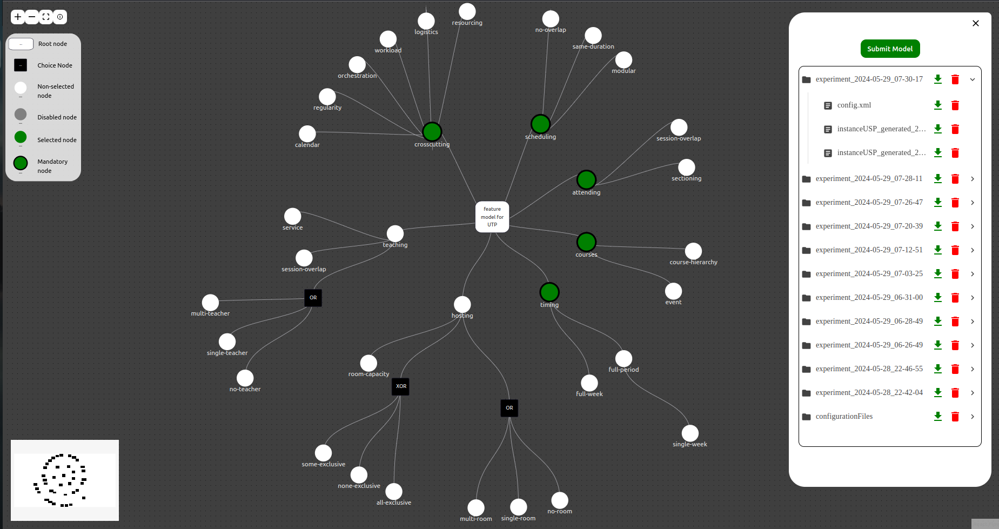

# Feature Model



## Prérequis

- Node.js récent et npm installés sur votre machine.

## Installation pour le développement

### Cloner le projet

Pour cloner le projet, utilisez la commande suivante :

```bash
git clone git@github.com:isJlaiel/projet_annuel.git
```
### Installation et démarrage du Backend

naviguez dans le répertoire :

```bash
cd feature_model_api
```
Installez les dépendances :

```bash
npm install
```
Démarrez le serveur backend :

```bash
npm run start
```


### Installation et démarrage du Frontend

naviguez dans le répertoire :

```bash
cd feature_model
```
Installez les dépendances :

```bash
npm install
```
Démarrez le serveur backend :

```bash
npm run dev
```

### Utilisation de Docker
#### Prérequis pour Docker
Docker installé

### Construire les conteneurs :

```bash

docker compose build
# Ou pour les versions plus anciennes de Docker :
docker-compose build 
```
### Lancer l'application 

```bash
docker-compose up
# Ou pour les versions plus anciennes de Docker :
docker compose up 
```
